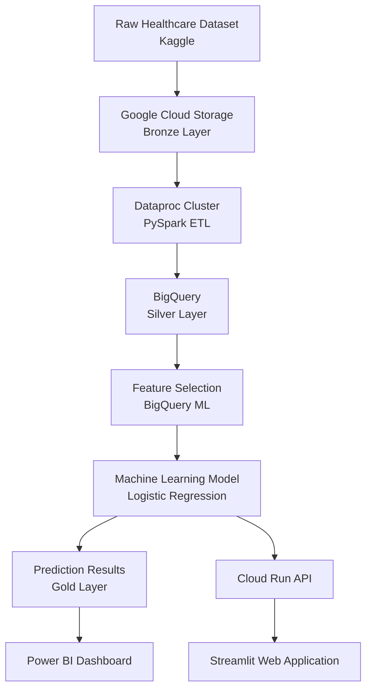
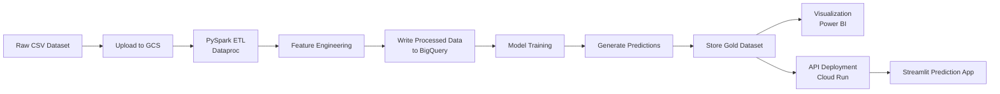

# Cloud-Based Heart Disease Prediction Pipeline

A cloud-based data engineering and machine learning pipeline designed to analyze healthcare indicators and predict the risk of heart disease.

This project demonstrates how modern cloud tools can be used to build an end-to-end data pipeline, from raw data ingestion to machine learning prediction and visualization.

The system integrates distributed data processing, serverless analytics, machine learning, and interactive dashboards within the Google Cloud ecosystem.

---

## Project Highlights

• Built a cloud-native healthcare analytics pipeline using Google Cloud services.

• Implemented distributed data processing using PySpark on Google Dataproc for large-scale ETL and feature engineering.

• Designed a layered data architecture (Bronze → Silver → Gold) using Google Cloud Storage and BigQuery.

• Developed a logistic regression model to predict heart disease risk factors using healthcare indicators.

• Handled class imbalance using SMOTE, improving model learning for minority cases.

• Deployed predictions into BigQuery Gold datasets for business intelligence dashboards.

• Created a Streamlit web application and Cloud Run API for real-time prediction services.

---

## System Architecture

The project follows a layered architecture separating data ingestion, processing, modeling, and analytics.



---

## Data Architecture

The pipeline uses a Bronze–Silver–Gold data lifecycle.

| Layer  | Purpose                          | Technology           |
| ------ | -------------------------------- | -------------------- |
| Bronze | Raw dataset storage              | Google Cloud Storage |
| Silver | Cleaned and processed dataset    | BigQuery             |
| Gold   | Prediction results for analytics | BigQuery             |

This layered structure ensures data quality and enables scalable analytics.

---

## Data Pipeline Workflow

The end-to-end data pipeline consists of several stages.


---

## Dataset

The dataset used is Indicators of Heart Disease Dataset from Kaggle.

The dataset contains demographic, lifestyle, and medical indicators that may contribute to heart disease risk.

Examples of features include:

- Age category

- Sex

- Smoking status

- Alcohol consumption

- Physical activity

- Diabetes history

- Angina history

- Stroke history

The dataset used in this project contains approximately 246,000 records.

---

## Data Processing

Data preprocessing and transformation are performed using PySpark on Google Dataproc.

Main steps include:

## Data Cleaning

- remove invalid records

- handle missing values

- convert categorical variables

## Feature Engineering

- BMI is calculated from height and weight.

---
## Feature Encoding

Categorical variables are converted using:

- StringIndexer

- numerical feature scaling

The processed dataset is then written to BigQuery Silver tables.
---

## Feature Selection

BigQuery ML is used to train an initial logistic regression model to evaluate feature importance.

Example query:

SELECT *
FROM ML.WEIGHTS(MODEL heart_logreg_model)
ORDER BY ABS(weight) DESC

The most influential features include indicators such as:

- angina history

- stroke history

- sex

- chest scan history

These selected features are used to train the final prediction model.

---

## Machine Learning Model

The final prediction model is Logistic Regression.

This model was selected because:

- it is interpretable

- suitable for binary classification

- commonly used in healthcare risk prediction


---

## Handling Class Imbalance

Heart attack cases are significantly fewer than non-cases.

To address this imbalance, the dataset is balanced using:

- SMOTE (Synthetic Minority Oversampling Technique)

This generates synthetic samples of the minority class to improve model learning.

---

## Model Performance

Model performance was evaluated using multiple metrics.

| Metric    | Score |
| --------- | ----- |
| Accuracy  | 0.76  |
| Precision | 0.91  |
| Recall    | 0.58  |
| F1 Score  | 0.71  |
| ROC-AUC   | 0.84  |


These results indicate that the model performs well at identifying potential heart disease cases while maintaining strong precision.

---

## Prediction Pipeline

After training, predictions are generated for the full dataset.

The predictions include:

- predicted label

- probability score

- risk category

Example risk bins:
| Probability | Risk Level |
| ----------- | ---------- |
| 0 – 0.2     | Low        |
| 0.2 – 0.4   | Mild       |
| 0.4 – 0.6   | Moderate   |
| 0.6 – 0.8   | High       |
| 0.8 – 1.0   | Very High  |

The results are stored in BigQuery Gold tables.

---


## Visualization

Prediction results are visualized using Power BI dashboards connected directly to BigQuery.

Example analytics include:

- heart attack risk distribution

- risk differences by gender

- risk associated with stroke history

- probability distribution of predicted risk

These dashboards help translate ML outputs into actionable insights.

---

## Deployment

The model is deployed as a cloud-based service.

Cloud Run API

A REST API is deployed using Google Cloud Run.
The API returns predicted risk probability.

---

## Streamlit Application

A Streamlit application provides an interactive user interface where users can input health indicators and receive predictions.

---


## Repository Structure 

```bash
heart-disease-cloud-ml-pipeline/

heart-disease-cloud-ml-pipeline/

README.md
requirements.txt

dataproc/
    dataproc_heart_analysis.py

bigquery/
    feature_selection.sql

vertex_ai/
    heart_model_training.py

deployment/

    cloudrun_api/
        app.py
        requirements.txt
        Dockerfile

    streamlit_app/
        app.py
        requirements.txt

visualization/
    powerbi_dashboard_notes.md


```

---

## Project Purpose

This project demonstrates how cloud-based infrastructure can be used to build scalable machine learning pipelines for healthcare analytics.

The system shows how data engineering, machine learning, and cloud services can work together to support predictive analytics and decision support.

---

